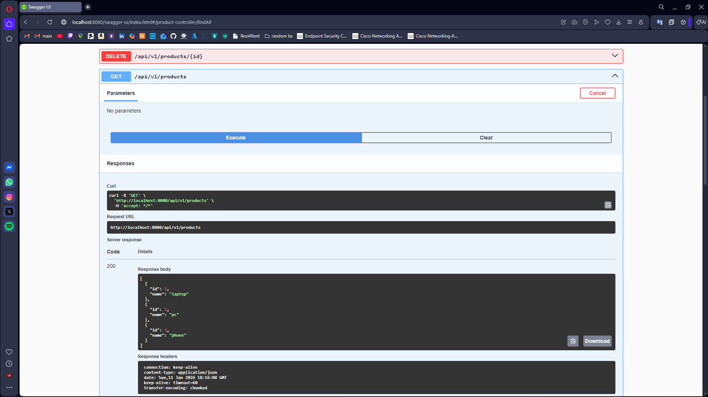
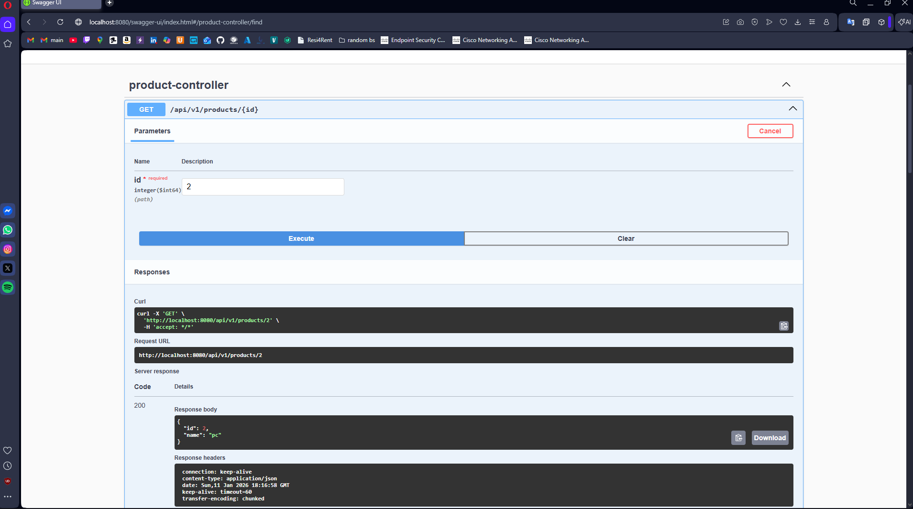
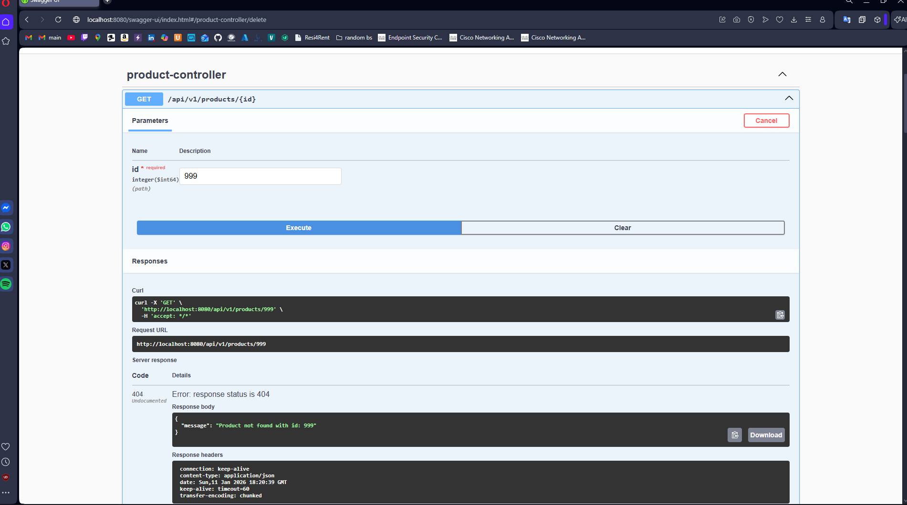
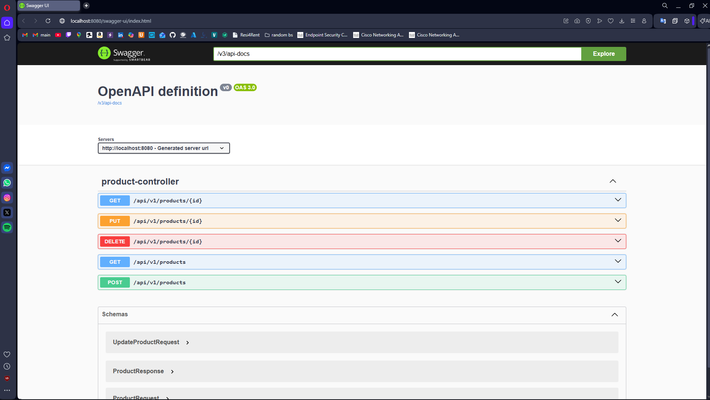

# Task 2 - REST API with Spring Boot (Product Management System)

## 📋 Project Description

A complete REST API for managing products, built with Spring Boot. This project demonstrates:

- ✅ RESTful API design with full CRUD operations
- ✅ Proper HTTP methods and status codes
- ✅ Exception handling with custom errors
- ✅ Database persistence using JPA and H2
- ✅ API documentation with Swagger/OpenAPI
- ✅ Clean layered architecture
- ✅ Request/Response DTOs for data transfer

---

## 🛠 Technologies Used

- **Java**: 17
- **Spring Boot**: 3.4.1
- **Spring Web**: RESTful services
- **Spring Data JPA**: Database abstraction
- **H2 Database**: In-memory database
- **Swagger/OpenAPI**: API documentation
- **Maven**: Build tool

---

## 🚀 How to Run

### Prerequisites
- Java 17 or higher
- Maven 3.6+
- IntelliJ IDEA (recommended)

### Steps

1. **Clone the repository:**
```bash
   git clone https://github.com/k0vouts/addaasd.git
   cd firstapi
```

2. **Run the application:**
```bash
   mvn spring-boot:run
```
   
   OR in IntelliJ:
   - Open project
   - Run `FirstapiApplication.java`

3. **Application starts on:**
```
   http://localhost:8080
```

4. **Access Swagger UI:**
```
   http://localhost:8080/swagger-ui/index.html
```

5. **Access H2 Console:**
```
   http://localhost:8080/console
   JDBC URL: jdbc:h2:mem:testdb
   Username: sa
   Password: (leave empty)
```

---

## 📡 API Endpoints

### Base URL
```
http://localhost:8080/api/v1/products
```

---

### 1️⃣ Create Product (POST)

**Endpoint:** `POST /api/v1/products`

**Description:** Creates a new product in the database

**Request Body:**
```json
{
  "name": "Laptop"
}
```

**Success Response (201 Created):**
```json
{
  "id": 1,
  "name": "Laptop"
}
```

**Example with cURL:**
```bash
curl -X POST http://localhost:8080/api/v1/products \
  -H "Content-Type: application/json" \
  -d '{"name":"Laptop"}'
```

**Screenshot:**


---

### 2️⃣ Get All Products (GET)

**Endpoint:** `GET /api/v1/products`

**Description:** Retrieves all products from the database

**Success Response (200 OK):**
```json
[
  {
    "id": 1,
    "name": "Laptop"
  },
  {
    "id": 2,
    "name": "Mouse"
  }
]
```

**Example with cURL:**
```bash
curl -X GET http://localhost:8080/api/v1/products
```

**Screenshot:**



---

### 3️⃣ Get Product by ID (GET)

**Endpoint:** `GET /api/v1/products/{id}`

**Description:** Retrieves a specific product by its ID

**Path Parameters:**
- `id` (required): Product ID

**Success Response (200 OK):**
```json
{
  "id": 1,
  "name": "Laptop"
}
```

**Error Response (404 Not Found):**
```json
{
  "message": "Product not found with id: 999"
}
```

**Example with cURL:**
```bash
curl -X GET http://localhost:8080/api/v1/products/1
```

**Screenshot:**



---

### 4️⃣ Update Product (PUT)

**Endpoint:** `PUT /api/v1/products/{id}`

**Description:** Updates an existing product

**Path Parameters:**
- `id` (required): Product ID

**Request Body:**
```json
{
  "name": "Gaming Laptop"
}
```

**Success Response (200 OK):**
```json
{
  "id": 1,
  "name": "Gaming Laptop"
}
```

**Error Response (404 Not Found):**
```json
{
  "message": "Product not found with id: 999"
}
```

**Example with cURL:**
```bash
curl -X PUT http://localhost:8080/api/v1/products/1 \
  -H "Content-Type: application/json" \
  -d '{"name":"Gaming Laptop"}'
```

**Screenshot:**


---

### 5️⃣ Delete Product (DELETE)

**Endpoint:** `DELETE /api/v1/products/{id}`

**Description:** Deletes a product from the database

**Path Parameters:**
- `id` (required): Product ID

**Success Response (204 No Content):**
```
(empty response body)
```

**Error Response (404 Not Found):**
```json
{
  "message": "Product not found with id: 999"
}
```

**Example with cURL:**
```bash
curl -X DELETE http://localhost:8080/api/v1/products/1
```

**Screenshot:**


---

## 📊 HTTP Status Codes

| Code | Status | When Used |
|------|--------|-----------|
| 200 | OK | Successful GET, PUT |
| 201 | Created | Successful POST |
| 204 | No Content | Successful DELETE |
| 404 | Not Found | Product doesn't exist |
| 500 | Internal Server Error | Unexpected error |

---

## 🚨 Exception Handling

The API implements proper error handling using:

- **Custom Exception:** `ProductNotFoundException`
- **Exception Supplier:** `ProductExceptionSupplier`
- **Global Handler:** `ProductExceptionAdvisor` with `@ControllerAdvice`
- **Error Response DTO:** `ErrorMessageResponse`

**Example Error Response (404 Not Found):**
```json
{
  "message": "Product not found with id: 999"
}
```

**Screenshot:**



---

## 📚 Swagger / OpenAPI Documentation

### Access Swagger UI

**URL:** http://localhost:8080/swagger-ui/index.html

Swagger provides:
- Interactive API documentation
- Ability to test endpoints directly in browser
- Request/response schemas
- No Postman needed!

### How to Use Swagger

1. Open http://localhost:8080/swagger-ui/index.html
2. Expand `product-controller`
3. Click on any endpoint (POST, GET, etc.)
4. Click **"Try it out"**
5. Fill in parameters/request body
6. Click **"Execute"**
7. View response below

**Screenshot:**



### JSON API Documentation

**URL:** http://localhost:8080/v3/api-docs

Returns the complete OpenAPI specification in JSON format.

---

## 🗄 H2 Database Console

### Access H2 Console

**URL:** http://localhost:8080/console

### Login Credentials
```
JDBC URL: jdbc:h2:mem:testdb
Username: sa
Password: (leave empty)
```

### Database Tables

- **PRODUCT**: Stores all products with ID and NAME columns

### Example SQL Queries

**View all products:**
```sql
SELECT * FROM PRODUCT;
```

**Count products:**
```sql
SELECT COUNT(*) FROM PRODUCT;
```

**Find specific product:**
```sql
SELECT * FROM PRODUCT WHERE ID = 1;
```

**Delete all products:**
```sql
DELETE FROM PRODUCT;
```

**Screenshot:**


---

## 📁 Project Structure
```
src/main/java/pl/vistula/firstapi/
├── FirstapiApplication.java              # Main Spring Boot application
├── product/
│   ├── api/
│   │   ├── ProductController.java        # REST endpoints
│   │   ├── request/
│   │   │   ├── ProductRequest.java       # POST request DTO
│   │   │   └── UpdateProductRequest.java # PUT request DTO
│   │   └── responce/
│   │       └── ProductResponse.java      # Response DTO
│   ├── domain/
│   │   └── Product.java                  # JPA Entity (database table)
│   ├── exception/
│   │   └── ProductNotFoundException.java # Custom exception
│   ├── repository/
│   │   └── ProductRepository.java        # JPA Repository interface
│   ├── service/
│   │   └── ProductService.java           # Business logic
│   └── support/
│       ├── ProductMapper.java            # DTO ↔ Entity converter
│       ├── ProductExceptionSupplier.java # Exception factory
│       └── ProductExceptionAdvisor.java  # Global exception handler
└── shared/
    └── api/
        └── response/
            └── ErrorMessageResponse.java  # Error response DTO

src/main/resources/
├── application.properties                # Configuration
└── static/                               # Static resources (if any)

screenshots/                              # Project screenshots
├── swagger-ui.png
├── post-request.png
├── get-all.png
├── get-by-id.png
├── put-request.png
├── delete-request.png
├── error-404.png
└── h2-console.png
```

---

## 🏗 Architecture Layers

### 1. API Layer (`api/`)
- **Controller**: Handles HTTP requests/responses
- **Request DTOs**: Data from client
- **Response DTOs**: Data to client
- **Annotations:** `@RestController`, `@RequestMapping`, `@PostMapping`, `@GetMapping`, `@PutMapping`, `@DeleteMapping`

### 2. Service Layer (`service/`)
- **Business Logic**: Data processing and validation
- **Orchestration**: Coordinates repository calls
- **Transaction Management**: Ensures data consistency
- **Annotation:** `@Service`

### 3. Repository Layer (`repository/`)
- **Data Access**: Database operations
- **JPA Interface**: Extends `JpaRepository<Product, Long>`
- **Auto-generated Methods**: `save()`, `findById()`, `findAll()`, `deleteById()`
- **Annotation:** `@Repository`

### 4. Domain Layer (`domain/`)
- **Entities**: Represent database tables
- **JPA Annotations:** `@Entity`, `@Table`, `@Id`, `@GeneratedValue`

### 5. Support Layer (`support/`)
- **Mapper**: Converts between DTOs and Entities
- **Exception Handling**: Custom errors and global handlers
- **Utilities**: Helper classes

---

## 🎓 Key Concepts Demonstrated

### Spring Annotations Used
```java
@RestController          // Marks class as REST API controller
@RequestMapping("/api")  // Base URL path
@GetMapping             // HTTP GET requests
@PostMapping            // HTTP POST requests
@PutMapping             // HTTP PUT requests
@DeleteMapping          // HTTP DELETE requests
@PathVariable           // Extract URL parameters
@RequestBody            // Parse JSON request body
@Service                // Business logic layer
@Repository             // Data access layer
@Entity                 // Database table
@Id                     // Primary key
@GeneratedValue         // Auto-increment ID
@ControllerAdvice       // Global exception handler
@ExceptionHandler       // Handle specific exceptions
```

### RESTful Principles

- **Resource-based URLs:** `/products`, `/products/{id}`
- **HTTP Methods:** POST (create), GET (read), PUT (update), DELETE (delete)
- **Status Codes:** 200, 201, 204, 404, 500
- **JSON Format:** Request and response bodies
- **Stateless:** Each request contains all necessary information

### Exception Handling Pattern

**Custom Exception:**
```java
public class ProductNotFoundException extends RuntimeException {
    public ProductNotFoundException(Long id) {
        super("Product not found with id: " + id);
    }
}
```

**Global Exception Handler:**
```java
@ControllerAdvice
public class ProductExceptionAdvisor {
    @ExceptionHandler(ProductNotFoundException.class)
    public ResponseEntity<ErrorMessageResponse> handleNotFound(
        ProductNotFoundException ex) {
        return ResponseEntity
            .status(HttpStatus.NOT_FOUND)
            .body(new ErrorMessageResponse(ex.getMessage()));
    }
}
```

### JPA Repository Pattern
```java
public interface ProductRepository extends JpaRepository<Product, Long> {
    // No code needed!
    // JpaRepository automatically provides:
    // - save(entity)
    // - findById(id)
    // - findAll()
    // - deleteById(id)
    // - count()
    // - existsById(id)
}
```

**Benefits:**
- ✅ No boilerplate code
- ✅ Type-safe queries
- ✅ Automatic transaction management
- ✅ Built-in pagination and sorting

---

## ✅ Testing Guide

### Complete Test Scenario

**1. CREATE two products:**
```bash
curl -X POST http://localhost:8080/api/v1/products \
  -H "Content-Type: application/json" \
  -d '{"name":"Laptop"}'

curl -X POST http://localhost:8080/api/v1/products \
  -H "Content-Type: application/json" \
  -d '{"name":"Mouse"}'
```

**2. GET ALL products:**
```bash
curl -X GET http://localhost:8080/api/v1/products
# Expected: Array with both products
```

**3. GET ONE product:**
```bash
curl -X GET http://localhost:8080/api/v1/products/1
# Expected: Single product object
```

**4. UPDATE product:**
```bash
curl -X PUT http://localhost:8080/api/v1/products/1 \
  -H "Content-Type: application/json" \
  -d '{"name":"Gaming Laptop"}'
# Expected: Updated product
```

**5. DELETE product:**
```bash
curl -X DELETE http://localhost:8080/api/v1/products/2
# Expected: 204 No Content
```

**6. TEST error handling:**
```bash
curl -X GET http://localhost:8080/api/v1/products/999
# Expected: 404 with error message
```

**7. VERIFY in H2 Console:**
- Go to http://localhost:8080/console
- Login with JDBC URL: `jdbc:h2:mem:testdb`
- Run: `SELECT * FROM PRODUCT;`
- Should show remaining products

### Testing Checklist

- [ ] Application starts without errors
- [ ] Swagger UI is accessible
- [ ] H2 Console is accessible
- [ ] POST creates product (201)
- [ ] GET returns all products (200)
- [ ] GET by ID returns product (200)
- [ ] PUT updates product (200)
- [ ] DELETE removes product (204)
- [ ] GET with invalid ID returns 404 with error message
- [ ] Data persists in H2 database
- [ ] All screenshots taken and added to README

---

## 🐛 Troubleshooting

### Port 8080 already in use
```bash
# Windows
netstat -ano | findstr :8080
taskkill /PID <PID> /F

# Mac/Linux
lsof -i :8080
kill -9 <PID>
```

### Application won't start
- Check Java version: `java -version` (should be 17+)
- Clean Maven: `mvn clean install -U`
- Rebuild project: Build → Rebuild Project in IntelliJ

### H2 Console not loading
- Verify `application.properties` has:
```properties
  spring.h2.console.enabled=true
  spring.h2.console.path=/console
  spring.datasource.url=jdbc:h2:mem:testdb
```

### Swagger not loading
- Check dependency in `pom.xml`
- Try: `http://localhost:8080/swagger-ui.html` (alternative URL)

---

## 👨‍💻 Author

**[Your Name]**  
Vistula University  
Computer Science / Software Engineering  
January 2026

---

## 📝 Assignment Information

- **Course:** Spring Framework Applications
- **Task:** Task 2 - REST API with CRUD Operations
- **Instructor:** mgr inż. Dominik Bielecki
- **Email:** d.bielecki@vistula.edu.pl
- **Deadline:** January 2026

---

## 📖 References

- [Spring Boot Documentation](https://spring.io/projects/spring-boot)
- [Spring Data JPA](https://spring.io/projects/spring-data-jpa)
- [Swagger/OpenAPI](https://swagger.io/)
- [H2 Database](https://www.h2database.com/)
- [RESTful API Design Best Practices](https://restfulapi.net/)

---

## 📜 License

This project is created for educational purposes as part of the Spring Framework course at Vistula University.
```

---

## 📸 **WHERE TO PUT SCREENSHOTS**

### Step 1: Create screenshots folder

In your `firstapi` project root (same level as `src/` and `pom.xml`):
```
firstapi/
├── screenshots/          ← CREATE THIS FOLDER
│   ├── swagger-ui.png
│   ├── post-request.png
│   ├── get-all.png
│   ├── get-by-id.png
│   ├── put-request.png
│   ├── delete-request.png
│   ├── error-404.png
│   └── h2-console.png
├── src/
├── pom.xml
└── README.md
